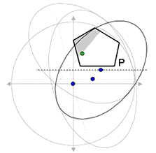
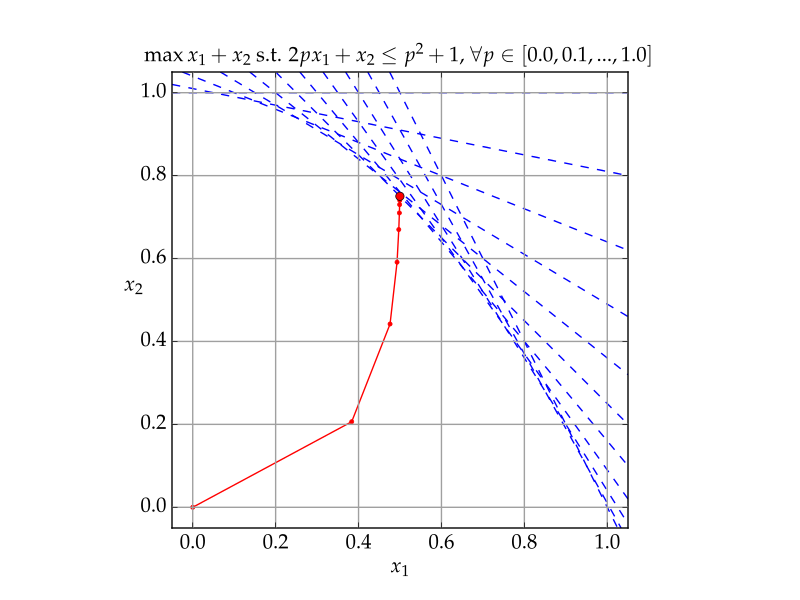

## Linear Programming

Scribe: Muhan Li

### Introduction

#### Definition

Linear programming problems can be expressed in canonical form as:
$$
{\displaystyle {\begin{aligned}&{\text{Maximize}}&&\mathbf {c} ^{\mathrm {T} }\mathbf {x} \\&{\text{subject to}}&&A\mathbf {x} \leq \mathbf {b} \\&{\text{and}}&&\mathbf {x} \geq \mathbf {0} \end{aligned}}}
$$

#### Convexity

Linear programming problems are **convex** problems:

> A *convex optimization problem* is a problem where all of the constraints are convex functions, and the objective is a convex function if minimizing, or a concave function if maximizing.
>
> Let feasible region $\mathcal{R} = \{x:\forall i, \langle a_i,x \rangle \geq b_i\}$, $\mathcal{R}$ is convex if:
> $$
> \forall x_1, x_2 \in \mathcal{R}, \forall \lambda \in [0, 1],\quad \lambda x_1 + (1-\lambda) x_2 \in \mathcal{R}
> $$

Since for linear programming (minimize form, therefore it is $\geq$ and not $\leq$), it is solving:
$$
\langle a, x_1 \rangle \geq b \\
\langle a, x_2 \rangle \geq b
$$
Then by linear combination:
$$
\langle a, \lambda x_1 + (1-\lambda) x_2 \rangle \geq b
$$
This shows that it is a convex problem.

#### Solving methods

1. [Simplex method](https://en.wikipedia.org/wiki/Simplex_algorithm)

   

   Since linear programming is convex, maximum/minimum value must locate on some edge, therefore LP solver start from a vertex of the convex feasible region, and each time choose a direction (linear constraint) to move on, and that direction is called the "pivotal" direction.

2. [Ellipsoid method](https://en.wikipedia.org/wiki/Ellipsoid_method)

   Each time choose the ellipsoid which contains the solution, make ellipsoid smaller and smaller.

   

3. [Interior point methods](https://en.wikipedia.org/wiki/Interior-point_method) 

   Similar to gradient descent.

   

### Duality

By computing the set of coefficients which linearly composes constraints into our minimization target, we get the dual LP minimization problem for our primal maximization problem:

#### Definition

**Primal LP**:
$$
min \langle c, x \rangle \\
Ax \geq b \\
x \geq 0
$$
**Dual LP**:
$$
max \langle b, x \rangle \\
A^tx \leq c \\
y \geq 0
$$
**Example**:

Primal LP problem:
$$
\begin{align*}
\min\ &2x_1 + 4x_2 + 8x_3 \\
&x_1 + x_2 \geq 1 \\
&x_2 + x_3 \geq 2 \\
&x_1 + 2x_3 \geq 3 \\
&x_1, x_2, x_3 \geq 0
\end{align*}
$$
Now we would like to linearly combine constraints to get our optimization target:
$$
\begin{align*}
&[x_1 + x_2 \geq 1] * y_1\\
&[x_2 + x_3 \geq 2] * y_2\\
&[x_1 + 2x_3 \geq 3] * y_3\\
&x_1, x_2, x_3 \geq 0 \\
(y_1+y_3)x_1 + (y_1+y_2)x_2 &+ (y_2+2y_3)x_3 \leq 2x_1 + 4x_2 + 8x_3 \\
\end{align*}
$$
And we get our dual LP problem:
$$
\begin{align*}
\max\ &y_1 + 2y_2 + 3y_3 \\
&y_1 + y_3 \leq 2 \\
&y_1 + y_2 \leq 4 \\
&y_2 + 2y_3 \leq 8 \\
&y_1, y_2, y_3 \geq 0
\end{align*}
$$
(Note $A^t$ coefficients for y, for non-existent terms, their coefficients are 0).

#### Weak and strong duality

**Weak duality**:

$\langle c, x \rangle \geq \langle b, y \rangle$ for all feasible solutions $x$ and $y$.

Proof:

$\langle c, x \rangle \geq \langle A^ty, x \rangle = \langle y, Ax \rangle \geq \langle b, y \rangle$

**Strong duality**:

$\langle c, x^* \rangle = \langle b, y^* \rangle$ for the optimal solutions $x^*$ and $y^*$.

### Complementary slackness

We observe that $x$ and $y$ are optimal solutions i.f.f.:

1. $\langle c, x \rangle = \langle A^ty, x \rangle$
2. $\langle y, Ax \rangle \geq \langle b, y \rangle$

Which means:

1. $\langle c - A^ty, x \rangle = 0$
2. $\langle y, Ax - b \rangle = 0$

therefore, either $c - A^ty = 0$ or $x = 0$, and either $Ax - b = 0$ or $y=0$, because $A^ty - c \leq 0$ and $Ax - b \geq 0$.

This introduces the **Complementary Slackness** (also known as the **KKT condition**):

>  Feasible solutions $x$ and $y$ are optimal i.f.f.:
>
> 1. $\forall i$, $x_i = 0$ or $(A^ty)_i = c_i$.
> 2. $\forall j$, $y_j = 0$ or $(Ax)_j = b_j$.

### Farkas' Lemma

We can also try to understand the linear programming problems from the angle of physics.

Let the coefficient vector of our primal LP optimization target be the direction of "gravity", and we let our solution, a singular point falls onto a set of hyperplanes defined by normal vectors $a_1,...,a_m$, it will eventually be stopped by one plane / a intersection junction formed by two or more planes, and that "low energy valley" is where our optimal solution will locate:
$$
min \langle -F, x \rangle \\
\langle a_1, x \rangle \geq b_1 \\
...\\
\langle a_m, x \rangle \geq b_m \\
x \geq 0
$$

In this way, our dual LP becomes:
$$
\exists y_1, y_2,...,y_m \geq 0 \\
\exists y_ia_i = -F \\
y_i = 0\text{ if }\langle a_i, x \rangle \neq b_i
$$

This can be explained as: when $\langle a_i, x \rangle = b_i$, our singularity falls on the plane $i$ defined by normal vector $a_i$, otherwise, it does not contact with that plane, and there is no support force, which makes $y_i = 0$.

This introduces us to **Ferkas' Lemma**:

> Let $x$ be the optimal solution, then there exists "contact normal forces" $y_1,...,y_n \geq 0$ such that:
>
> 1. $\sum y_j a_j = -F$
> 2. $y_j = 0\text{ if }\langle a_j, x \rangle \neq b_j$​

Note Farkas' Lemma implies strong duality in rule 2.

With Farkas' Lemma we know that:

1. All remaining constraints are **essential** (remove/alter any of them will change the optimal value).
2. All remaining constraints touch $x^*$