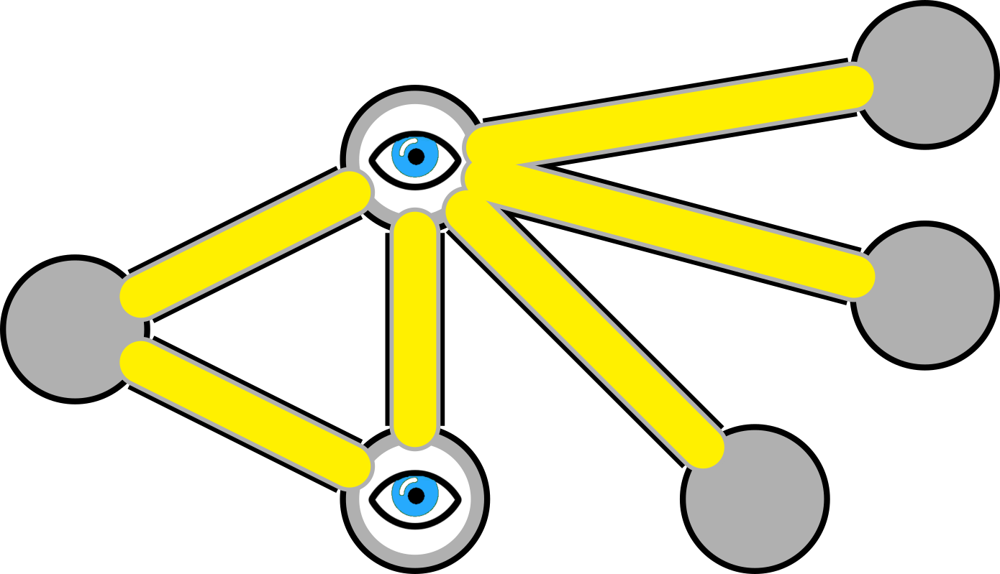

## Parameterized algorithms

Scribe: Muhan Li

(A large part of this note is based on this [scribe note](http://www.cs.cmu.edu/afs/cs/academic/class/15750-s17/ScribeNotes/lecture38.pdf) of CMU 15750)

### Introduction

#### NP-hard problems

NP-hard problems are at least as hard as the hardest of all NP problems, its formal mathematical definition is: 
$$
\text{$L$ is $NP$-hard if $L \le_p L' \quad \forall L' \in NP$}
$$
It is presumed that NP-hard problems are hard to solve, or intractable. Therefore, we are seeking methods to solve NP-hard problems by relaxing some conditions to make them tractable.  Some examples include:

1. Approximation algorithms: use approximation instead of solving the problem exactly, such as relaxing integer programming to linear programming.
2. BWCA (beyond worst case analysis): try to model the real world and use various methods to compare the performance of our algorithm in the "real" environment with $OPT$ (optimal algorithm & optimal solution). An example of such comparison is resource augmentation.
3. FPT: the thing we are going to talk about.

#### Fixed-parameter tractablity

Suppose the complexity of $OPT$ is $k$. 

A fixed parameter tractable (FPT) algorithm with fixed parameter $k$ and input size $n$ is an algorithm with $O(f(k) × poly(n))$ time complexity.

Note:

3. $f(k)$ does not depend on n.
2. $f(k)$ must not be polynomial of k, otherwise we could let $k = n$ and conclude $P = NP$!

---

### FPT for path/cycle searching

To show how we use $k$ to limit the scale of our ptoblem and make it solvable, we will construct a path searching problem from some well-known base problems and then solve it.

#### Problem construction

**Problem 1**: In graph $G$, find the longest path which visits any vertex at most once. 

> This problem is equivalent to a Hamiltonian path problem when the longest length is equal to $n$, the number of all nodes in $G$, and therefore is NP hard.

Since we cannot solve problem 1 with a polynomial-time algorithm, we are going to add a constraint on path length.

**Problem 2**: In graph $G$, is there a path of length $k$ which visits any vertex at most once? 

(Note: For $k = n$, is is equal to Problem 1, it is NP hard, cannot be polynomial time, therefore we assume $k \ll n$)

It is easy to prove that this algorithm can be solved in polynomial time $O(n^k)$with the following recursive algorithm:

```
def find_path_length_k(start, k, visited):
	if k = 0:
		return True
	for u in neighbor(start) and u not in visited:
		result = find_path_length_k(u, k-1, visited + {start})
		if result:
			return result
	return False
```

#### A better solution using Color coding

If we introduce some randomness:

> Repeat for $k^k \log (\frac{1}{\delta})$ times:
>
> - Color all vertices with k colors (randomly, independently)
> - Look for a path: 1->2->3....->k using dynamic programming:
>   - Mark all nodes with color 1.
>   - For i from 2 to k, mark nodes with color i if they are connected to any marked nodes with color i-1. 

The time complexity is: $O(n) * k^k$

##### Proof

Let constant $\delta \ll 1$.

For a specified set of nodes $n_1, n_2, ..., n_k$ in a path $L, |L|=k, L \subset G$ , the probability of each of them being correctly colored from $1 \rightarrow k$ is: 
$$
P\{n_1 = 1, ..., n_k = k\} = (\frac{1}{k})^k
$$
Therefore an upper bound of the probability of not finding some path of length $k$ in each iteration is:
$$
P\{\text{Not found in iteration $t$}\} \le (1-(\frac{1}{k})^k)
$$
Therefore the probability of failing in all iterations is:
$$
\begin{align*}
&P\{\text{Not found}\} \\
&\le (1-(\frac{1}{k})^k)^{k^k log 1/\delta} \\
&\le (\frac{1}{e})^{log 1/\delta} \\
&= \delta \\
& \ll 1
\end{align*}
$$


So with high probability we are going to find some path of length $k$ if $\delta$ is small enough.

---

##### Optimization?

If we do not require all nodes in path $L$ to be colored exactly in the order of $1 \rightarrow k$, and just require all nodes in $L$ have distinct colors:
$$
P\{\text{all vertices on a path of length k have distinct colors}\} = \frac{k!}{k^k} \ge (\frac{k}{e})^k/k^k = (\frac{1}{e})^k
$$
Which is significantly greater than $(\frac{1}{k})^k$ when $k \gg e$, however, we cannot use the dynamic programming structure of our algorithm to find paths anymore because nodes are not colored in order in this case, and we probably need to store previously encountered nodes for each path, which introduces much more space complexity and time complexity on marking data management.

##### Adapt to cycle searching

For cycles, we just need to add one modification: a starter node.

> - Before each random coloring iteration, choose a random starter node $s$ from all nodes.
> - Run the same coloring process and connection checking process in our previous algorithm, except that we assign $k-1$ colors, and nodes with color 1 are marked if they are connected to starter node $s$.
> - Check if any node with color $k-1$ is marked and connect to starter node $s$.

### FPT for vertex cover

#### The vertex covering problem

The basic gist is:

> We have a set of roads and junctions. We want to place security cameras at specific junctions such that all roads are monitored.



The formal mathematical definition is:

> For graph $G = (V, E)$, find set $S \subseteq V$ with min $|S|$, such that $\forall e = (u, v) \in E, u \in S \vee e \in S$.

This is also a NP-hard problem, so we also have to put a constraint on the size of vertex cover and ask:

**Problem**: Is there a vertex cover of size at most k?

It is also easy to prove that there exists a FPT algorithm of time complexity $O(2^kn)$ using the bounded tree search algorithm:

```
def bounded_search(G, k):
	if k = 0:
		return 0 if G.empty() else FAILED
	if G.empty():
		return 0
	for edge e = (u, v) in G:
		b_1 = bounded_search(G - {u}, k-1)
		b_2 = bounded_search(G - {v}, k-1)
		return min(b_1, b_2) + 1
```

You may refer to the scribe note from CMU 15750 for a more detailed proof.

#### FPT for vertex cover with kernelization

The main idea of "kernalization" is reducing the graph to a hard to solve "kernel" which requires exponential time, and remove other parts of the graph $G$ to reduce problem scale.

We will apply three rules, two of them iteratively, to perform problem reduction:

> Apply rule 1 and 2 to $G$ iteratively until we can't anymore:
>
> - Rule 1: If vertex $v$ has degree 0, remove $v$ (remove isolated vertices).
>
> - Rule 2: If $\exists v, \deg v > k$, include $v$ in solution set $S$, perform update: $G' = G - \{u\}, k' = k - 1$.
>
>   ($v$ must be in the cover, otherwise to cover the edge $v$ connects to would require $> k$ vertices.)
>
> Rule 3: If $\forall v,\deg v \le k'$, and $|E'| > k'^2$, return FAILED.
>
> Run brute force checking on the remaining kernel $K(G', k')$

Since $G'$ has at most $k'^2$ edges, at most $k'^2$ vertices, using brute force checking, we will check all subsets of $V'$ of size $\le k'$, with cost $\le {k'^2 \choose k'} * k'$. Or we can use the bounded tree search method with cost $2^kk^2$.

The overall cost is:

1. $O(n^2)$ for applying rules. (Since the number of vertices in $G$ decreases in each iteration and for every vertex we run through $O(n)$ vertices to apply Rule 2.)
2. $2^kk^2$ for solving kernel (if we use the bounded search method).

Which yields $O(n^2 + 2^kk^2)$ time complexity.

